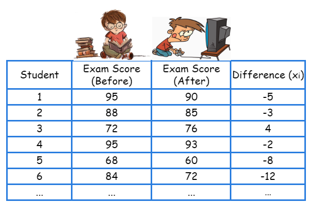
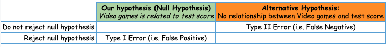

# Introducing Statistical Hypothesis to My 12-year-old Nephew 

Over the past few months, my nephew has heard me talking too much about the word “Statistics” but he does not know what it really is. As I am finishing my journey at the Master of Data Science program, I think it can be a good idea to introduce Statistics to him in a way that he can understand. At the same time, I can strengthen the knowledge I have learned from the program as I write the blog explaining the terminologies. 

Imagine your mom strictly prohibits you from playing video games because she believes that gaming will badly affect your academic performance. You may argue that gaming has a lot of advantages too, so it would not affect your exam scores. You can evidence your thought of whether playing video games is associated with exam score by using **Classical statistical hypothesis** testing from Statistics. 

I will simplify the data collection process here because the goal is to explain the concept for the statistical hypothesis. Let’s randomly collect 50 students who haven’t played video games until the recent semester, and record their exam scores from last semester (before gaming) and this semester (after gaming). Then we can observe the differences between the two exam scores for each student as shown below. Our hypothesis is that playing video games has no association with the exam scores. This is what we called **Null Hypothesis** in this example. 




<!-- #region -->
## What do our samples tell us?
Now, the question you may think about is how we can use our collected data to verify this hypothesis. We first need to get the difference exam scores of all 50 students between the two semesters, and then we take the average. By doing these, we can tell how likely the scores are different before and after playing video games. We can also see how the score differences vary, and where they center at. If the differences of scores are all close to zero, we can say that at least for our sample data, playing video games does not seem to be related to a lower exam score. 

## More broader cases
Once we know some key properties of our sample data, we may use some statistical methods to generalize this sample observation to a broader group of people (i.e. population), and eventually draw a conclusion to our hypothesis statement. The conclusion will be either rejecting our null hypothesis or not rejecting it. The conclusion is based on one important measurement called p-value. You can think of the p-value as how likely the null hypothesis is true, i.e. playing video games is not associated with exam scores. The smaller the p-value, the more unlikely the null hypothesis will happen. We commonly use a threshold of 0.05 to compare p-value with. If p-value is less than 0.05, we have enough evidence to reject the null hypothesis, and say that playing video games is somewhat related to the exam score. I did not go deeper into the calculation but it will not stop you from understanding the main concept of a classical statistical hypothesis testing. 

## How does my hypothesis testing perform?

It is important to know how great your hypothesis testing is. Let’s say that our test suggests that we reject our null hypothesis, which indicates no relationship between video games and test score. As a result, you decide to play video games a few hours a day. Later, you may end up with not enough time for studying for the exam and thus fail it. You will be scolded by your mom. This is what we called a “Type I Error” or “False Positive”. Alternatively, let’s say our test suggests that we do not reject our null hypothesis, which indicates that video games may have some bad impact on your test score. You will likely not play video games at all. But what if our suggestion is wrong? You could have played a lot of games and still get a good score on your exams. 


Statistical hypothesis is a very broad topic in Statistics but I believe now you have a good overall picture about it, or at least you are confident to explain some key aspects in front of your friends at school. After reading this blog, I hope you feel inspired to go deeper into the Statistics world.

<!-- #endregion -->

```python

```
